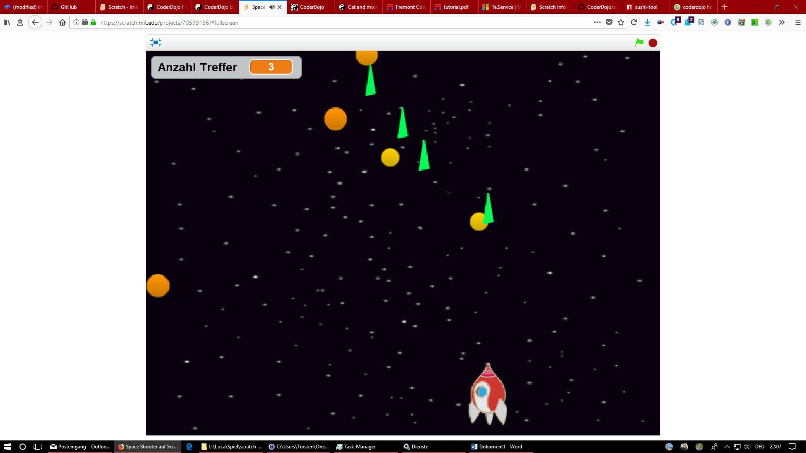
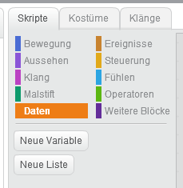

In diesem Projekt programmierst Du mit Scratch ein Spiel, in dem Du die
Erde vor herabfallenden Meteoriten retten musst. Dabei musst Du die
Meteoriten mit Deinem Raumschiff abschießen, bevor diese den unteren
Rand des Bildschirms berühren. So könnte ein mögliches Spielfeld
aussehen:

Wie soll das Spiel funktionieren?
=================================

Du fliegst mit Deinem Raumschiff um unteren Bildschirmrand und kannst
das Raumschiff mit Hilfe der Pfeiltasten von links nach rechts und
rechts nach links steuern (Du kannst gerne auch andere Tasten Deiner
Wahl verwenden). Aus dem Weltall (oberer Bildschirmrand) fliegen in
unregelmäßigen Abständen und von unterschiedlichen Stellen Meteoriten in
Richtung Erde (unterer Bildschirmrand).

Tipp:

Um das gleiche Sprite mehrfach auf dem Bildschirm anzeigen zu lassen
gibt es in Scratch die Möglichkeit, einen Klon eines Sprite zu
erstellen. Alle Klone führen die gleichen Befehle aus wie das erste
Sprite. Mit dem folgenden Block wird ein Klon erstellt:

*Ein Beschreibung des Blocks findest Du hier:
https://scratch-dach.info/wiki/Erzeuge\_Klon\_von\_()\_(Block)*

*Eine Anleitung für die Verwendung von Klonen findest Du hier:
https://scratch-dach.info/wiki/Klonen*

Mit Hilfe der Leertaste (Space) kannst Du einzelne Laserstrahlen von
Deinem Raumschiff abschießen. Wenn diese Laserstrahlen einen Meteoriten
treffen wird Dieser zerstört und kann die Erde nicht mehr treffen. Für
jeden zerstörten Meteoriten wird Deinem Punktekonto ein Punkt
hinzugefügt.

Tipp:

Um Punktestände oder andere Informationen in einem Programm zu speichern
kannst Du Variablen verwenden. Variablen müssen vor der Verwendung
angelegt werden. Dazu gibt es den Befehl „Neue Variable" im Bereich
„Daten".

{width="2.081383420822397in"
height="2.1359175415573053in"}{width="2.40625in"
height="2.1458333333333335in"}

Wenn Du eine Variable angelegt hast gibt es verschiedene Blöcke, mit
denen Du die Werte in den Variablen verändern kannst. Für einen
Punktzähler kannst Du z. B. den Block
{width="1.103999343832021in"
height="0.2222331583552056in"} verwenden um bei einem Treffer den
Punktestand zu erhöhen. Mit dem gleichen Block kannst Du den Punktestand
auch verkleinern wenn ein Meteorit den unteren Bildschirmrand erreicht
hat.

Du hast das Spiel gewonnen, wenn Du einen vor Dir vorher festgelegten
Punktestand erreicht hast. Fliegen so viele Meteoriten an Dir vorbei
dass der Punktestand 0 wird hast Du das Spiel verloren.

Was lernst Du bei diesem Projekt:
=================================

-   Wie Du mit Hilfe von Klonen ein Sprite mehrfach am Bildschirm
    darstellen kannst

-   Wie Du mit Hilfe von Variablen den Punktestand speichern kannst.

Mögliche Erweiterungen oder Varianten
=====================================

-   Füge Töne hinzu, z. B. einen Ton beim Abschießen eines Laserstrahls

-   Die Meteoriten fliegen mit der Zeit mit einer höheren
    Geschwindigkeit durchs Weltall

-   Mit der Zeit fliegen immer mehr Meteoriten gleichzeitig durchs
    Weltall

-   Der Hintergrund bewegt sich langsam von oben nach unten damit es so
    aussieht, als würde Dein Raumschiff durch das Weltall fliegen
