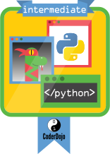

# Fortgeschrittene

"The owner of this badge has proven their creativity and knowledge of Python by demonstrating principles of the language including:

- Using lists to store variables, as well as common list operations: append, remove, reverse, length.

- Using dictionaries to store key/value pairs

- Using for loops: Repeat some code a number of times, or on a list

- Using Functions: Re-use your code, or someone else's

- Using Files: Read from, write and append to a text file

To earn this badge the applicant must first have been awarded the Python Beginner Badge.

