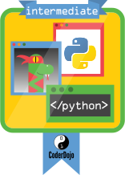

# Python Fortgeschrittene

Der Besitzer dieses Abzeichens hat seine Kreativität und sein Wissen über die Kenntnis der folgenden Kernprinzipen über Python bewiesen:

* Der Ninja kann Listen zum Speichern von Variablen verwenden und er kennt einfache Listenfunktionen wie append, remove, reverse und length
* Der Ninja kann Dictionaries zum Speichern von Schlüssel/Wertepaaren (key/value pairs) verwenden
* Der Ninja kann for-Schleifen verwenden um gleichen Code mehrfach hintereinander auszuführen. Die Anzahl an Wiederholungen kann auf einer Zahlenmenge oder auf einer Liste basieren
* Der Ninja kann Funktionen einsetzen um einmal geschriebenen Code wiederzuverwenden
* Der Ninja kann einfach Dateioperationen wie das Lesen aus einer Datei (read), das Schreiben in eine Datei (write) oder das Anhängen von Inhalt an eine Datei (append)

Der Nachweis kann durch das selbstständige Schreiben eines oder mehrere Python Programme nachgewiesen werden in denen die o. g. Kernprinzipien enthalten sind.

Um diesem Badge zu erhalten muss dem Ninja erst der Python Beginner Badge verliehen worden sein.

